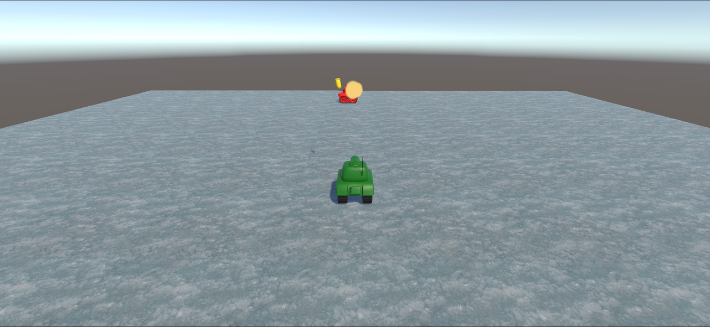
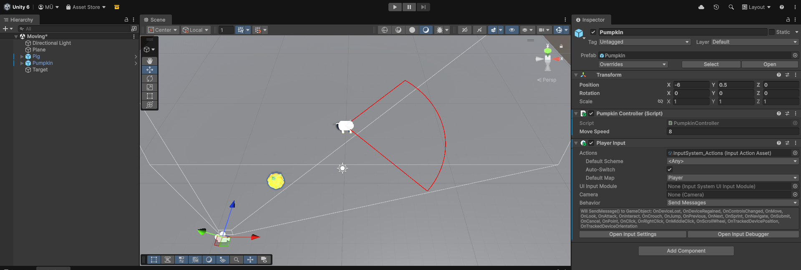
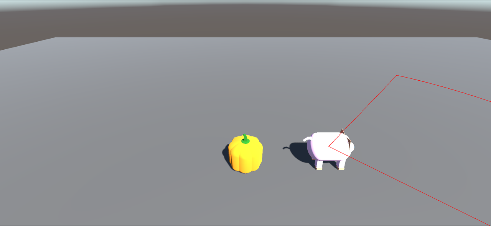
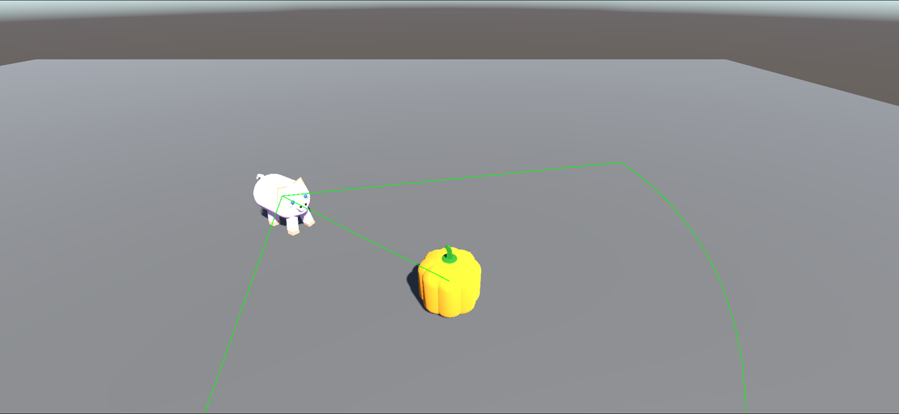
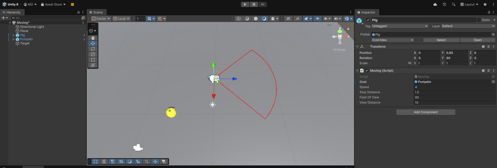
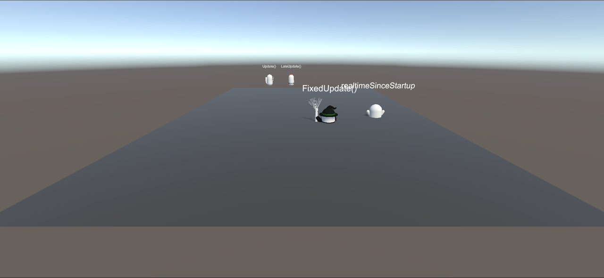
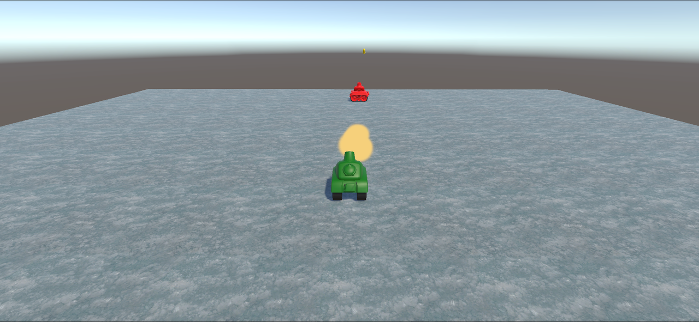
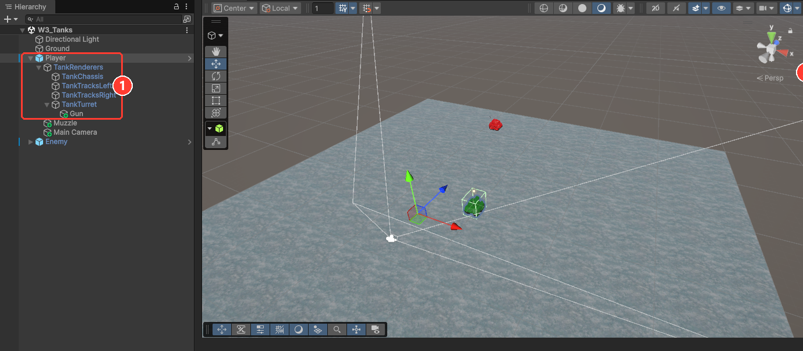

# BLM5026 – AI in Computer Games

Unity project developed throughout the **BLM5026 – AI in Computer Games** course. Each week the topic covered in class is implemented in the same project, and that week's summary and homework are added to this page.

**▶ [Play the demo in your browser](https://muratunlu0.github.io/BLM5026_AI_InComputerGames/)**: the link opens the latest week's build (week 3 right now). It is a WebGL build that fills the browser window and starts right away, nothing to install. Every week's build stays online, see the table below.



## Weekly progress

| Week | Topic | Scenes | Demo |
|:----:|-------|--------|:----:|
| 2 | Math for game AI: vectors, moving toward a goal, field of view (FOV) | `Assets/Moving.unity`, `Assets/Scenes/SampleScene.unity` | [Play](https://muratunlu0.github.io/BLM5026_AI_InComputerGames/week2/) |
| 3 | The physics of AI: time and update loops, `Time.deltaTime`, speed vs. velocity, predicting a moving target, acceleration, drag and gravity | `Assets/Week3/Scenes/W3_Tanks.unity`, `W3_Time.unity`, `W3_Cubes.unity`, `W3_Velocity.unity` | [Play](https://muratunlu0.github.io/BLM5026_AI_InComputerGames/week3/) |

A new row and a new section are added as the weeks go on.

## Running the project

1. Clone the repository and add the folder in Unity Hub with **Add → Add project from disk**.
2. Open the project with **Unity 6.3 LTS (6000.3.24f1)**.
3. Open the scene of the week you want to try (`Assets/Week3/Scenes/W3_Tanks.unity` for week 3, `Assets/Moving.unity` for week 2).
4. Press **Play** and click on the Game window.

| Key | Action |
|-----|--------|
| W / A / S / D or arrow keys | Move the player (the Pumpkin in week 2, the green tank in week 3) |
| Space | Week 3: predicted shot at the moving enemy |
| T / G | Week 3: raise / lower the turret |
| B | Week 3: fire a physics shell from the turret |
| F (hold) | Week 3: ballistic shots at the enemy, the turret aims itself |

---

## Week 2 – Math for Game AI

Game AI looks like behavior from the outside, but underneath it is geometry, algebra and update rules that run every frame. This week builds the basic tools for movement, pursuit and perception.

### Covered in class

- **Points and vectors:** a point is a location, a vector is a displacement; adding a vector to a point gives a new point.
- **Magnitude and normalization:** `v.normalized` keeps the direction and makes the length 1; for a consistent speed, direction and speed are kept separate.
- **Moving toward a goal:** `direction = goal - position`, then `position += direction.normalized * speed * Time.deltaTime`.
- **Stop distance and facing:** comparisons use `sqrMagnitude`, and the character is turned toward the goal with `transform.forward`.
- **Dot product and FOV cone:** the sign of the dot product tells front from behind, while `Vector3.Angle(forward, toTarget) <= halfFOV` gives a view cone.

### Implementation

| Object | Script | Role |
|--------|--------|------|
| Pumpkin (player) | [`PumpkinController.cs`](Assets/Scripts/PumpkinController.cs) | Reads the `Vector2` input from the `OnMove` message sent by the Player Input component and moves the player on the ground plane. The camera is a child of Pumpkin, so it follows the player. |
| Pig (AI) | [`Moving.cs`](Assets/Moving.cs) | If it can see the goal, turns toward it and approaches at a constant speed until the stop distance. |
| DrawVectors | [`DrawVectrors.cs`](Assets/Scripts/DrawVectrors.cs) | In-class activity: adds the vector v = <4, −1> to the points P = (2, 3) and Q = (−3, 2) and draws them in the Scene view. |



### Homework: follow only inside the field of view

> When the player stays behind the pig, outside its field of view, the pig cannot see the player and must not follow. Once the player gets in front of the pig, inside its view angle, the pig should start following.

Every frame the pig computes the vector to the player and checks two conditions: is the angle between that vector and its forward direction smaller than half of the view angle, and is the player within the view distance. If both hold it chases the player, otherwise it stays where it is. The view cone is drawn in `OnDrawGizmos`: **red** when the player is not visible, **green** when it is.

Try it in the [week 2 demo](https://muratunlu0.github.io/BLM5026_AI_InComputerGames/week2/): the pig faces right at the start and ignores you while you stay behind it; walk in front of it and it turns and follows. Gizmos only exist in the editor, so the cone itself is not drawn in the browser build.

| Player behind the pig: no chase | Player inside the cone: chase |
|:--:|:--:|
|  |  |

The settings can be changed on the **Moving** component of the Pig:

| Field | Default | Description |
|-------|:-------:|-------------|
| Goal | Pumpkin | Object to follow |
| Speed | 4 | Movement speed (units/s) |
| Stop Distance | 1.5 | Stops when this close to the goal |
| Field Of View | 90 | Total view angle (degrees) |
| View Distance | 10 | How far the pig can see |



---

## Week 3 – The Physics of AI

Moving things in a game means dealing with time, speed, velocity and acceleration. This week starts with how Unity's update loops run, makes movement frame-rate independent, then builds up to a tank that fires at a moving target and shells that fly under gravity.

### Covered in class

- **Time and update loops:** `FixedUpdate` runs on a fixed timestep (0.02 s), `Update` once per rendered frame, `LateUpdate` after all updates; `Time.realtimeSinceStartup` is the wall clock. Movement written "per call" runs at a different speed on every machine.
- **Normalizing with `Time.deltaTime`:** multiplying movement and rotation by the frame time gives the same result at any frame rate; a `speed` field makes it tunable in the Inspector.
- **Speed vs. velocity:** speed is a scalar, velocity is a vector. `transform.Translate(0, 0, speed * Time.deltaTime)` moves along the local Z axis; adding a Y component makes the path diagonal.
- **Predicting a moving target:** the shell and the target must be at the same place at the same time, `s·t = |p + v·t|`, which is a quadratic in `t`. `CalculateTrajectory()` solves it with `Vector3.Dot` and returns the direction to aim at.
- **Acceleration and Newton's second law:** `a = F / m`. A one-time impulse at launch, then drag and gravity applied every frame, give a ballistic arc.

### Implementation

| Scene | Scripts | What it shows |
|-------|---------|---------------|
| `W3_Time` | [`UpdateMove`](Assets/Week3/Scripts/UpdateMove.cs), [`LateUpdateMove`](Assets/Week3/Scripts/LateUpdateMove.cs), [`FixedUpdateMove`](Assets/Week3/Scripts/FixedUpdateMove.cs), [`SecondsUpdate`](Assets/Week3/Scripts/SecondsUpdate.cs) | Four characters moved from different update loops. With **Use Delta Time** off they drift apart (Update runs hundreds of times a second, FixedUpdate 50 times); with it on all four walk side by side at 1 m/s. |
| `W3_Cubes` | the same four scripts | The class version of the experiment with four coloured cubes (red Update, blue LateUpdate, green FixedUpdate, black realtime) instead of characters. |
| `W3_Velocity` | [`MoveShell`](Assets/Week3/Scripts/MoveShell.cs) | Two shells: one straight along its local Z axis, one with a vertical factor of 0.5 so it climbs while moving. |
| `W3_Tanks` | [`Drive`](Assets/Week3/Scripts/Drive.cs), [`FireShell`](Assets/Week3/Scripts/FireShell.cs), [`Shell`](Assets/Week3/Scripts/Shell.cs), [`ShellImpact`](Assets/Week3/Scripts/ShellImpact.cs), [`DestroyShell`](Assets/Week3/Scripts/DestroyShell.cs), [`AIFire`](Assets/Week3/Scripts/AIFire.cs), [`AlignToVelocity`](Assets/Week3/Scripts/AlignToVelocity.cs) | The player tank against a patrolling enemy. Space fires a predicted straight shot, B fires a physics shell from the turret, F fires ballistic shells that lead the enemy, and the enemy answers with ballistic shells of its own. |

| Time experiment without `Time.deltaTime` | Enemy shell landing on the player |
|:--:|:--:|
|  |  |

**Predicted shot (Space).** `FireShell.CalculateTrajectory()` takes the enemy's position and velocity (its `Drive` speed along its forward vector) and the shell speed, solves the intercept quadratic and turns the tank toward the intercept point before spawning a `ShellStraight`. The enemy drives at 3 m/s and the shell flies at 12 m/s, so the tank has to aim well ahead of it.

**Physics shell (B).** `Shell.cs` gets its initial speed once in `Start` from `force / mass`, then every frame applies drag (`speed *= 1 - drag * dt`), adds gravity to a vertical speed and translates along its local axes. Mass 2, force 30, drag 0.1 and gravity −9.8 are set on the prefab; raise the turret with T and the shell draws a visible arc.

**Enemy fire.** `AIFire.cs` on the enemy computes the launch angle that reaches the player at the current distance, `tan θ = (s² ± √(s⁴ − g(g·x² + 2·y·s²))) / (g·x)`, points the turret at that angle and every 2.5 s spawns an `AIShell` whose Rigidbody has gravity on and gets `linearVelocity = speed * gun.forward`. It aims at where you are now, not where you will be, so keep moving.

**Player's ballistic shots (hold F).** The same angle calculation runs on the player's tank through `FireShell.FireBallistic()`. Because the enemy is moving, the aim point is corrected for the flight time: the angle and flight time are computed for the enemy's current position, the aim point is moved by `enemy velocity × flight time`, and the calculation is repeated three times. The turret then turns to that point and an `AIShell` is launched every 0.2 s while F is held, so a stream of shells arcs onto the moving enemy. The `Shell` prefab also has a **Continuous Force** switch that reproduces the "rocket" behaviour from the slides, where the acceleration keeps acting every frame instead of once at launch.

The turret-controlled physics shell, the enemy's fire and the player's F shots were finished after the session.



| Key | Action |
|-----|--------|
| W / S | Drive forward / backward |
| A / D | Turn left / right |
| Space | Predicted shot at the enemy |
| T / G | Raise / lower the turret |
| B | Fire a physics shell |
| F (hold) | Ballistic shots that lead the enemy |

The [week 3 demo](https://muratunlu0.github.io/BLM5026_AI_InComputerGames/week3/) contains all four scenes. The buttons at the top left switch between **Tanks**, **Time**, **Cubes** and **Velocity**, **Restart** reloads the current scene, and in the two time scenes the **Use Delta Time** button turns the normalization off and on so the four characters can be compared in the browser as well. The buttons live on a small `DemoUI` prefab (a Canvas with legacy UI buttons wired to [`SceneSwitcher.cs`](Assets/Week3/Scripts/SceneSwitcher.cs) and [`TimeExperiment.cs`](Assets/Week3/Scripts/TimeExperiment.cs)) that sits in each of the four scenes.

The tank, shell and explosion assets come from the course packages. Their materials use URP shaders, so the project was switched from the Built-in render pipeline to the Universal Render Pipeline this week (`Assets/Settings`).

---

## Folder structure

```
Assets/
├── Easy Primitive People/        Ready-made characters from the week 2 starter package
├── Materials/
├── Scenes/
│   └── SampleScene.unity         Week 2 vector drawing activity
├── Scripts/
│   ├── DrawVectrors.cs
│   └── PumpkinController.cs
├── Settings/                     URP render pipeline assets
├── Week3/
│   ├── Materials/                Snow ground, tank colours, explosion
│   ├── Models/                   Tank.fbx, Shell.fbx and the tank prefabs
│   ├── Prefabs/                  Shell, ShellStraight, AIShell, ShellExplosion
│   ├── Scenes/                   W3_Time, W3_Cubes, W3_Velocity, W3_Tanks
│   ├── Scripts/
│   ├── Sprites/
│   └── Textures/
├── InputSystem_Actions.inputactions
├── Moving.cs
└── Moving.unity                  Week 2 pursuit and FOV scene
Docs/
├── Week2/                        Screenshots used in this README
└── Week3/
```

## Environment

- Unity 6.3 LTS (6000.3.24f1), Universal Render Pipeline 17.3 (Built-in until week 2)
- Input System 1.20.0
